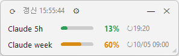
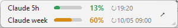

# AI Usage Widget

Claude Code / Codex CLI의 **5시간·주간 한도 사용률**을 Windows 트레이 아이콘과 항상 위에 떠 있는 작은 창(PiP)으로 표시합니다. (Windows 10/11 전용, 비공식 도구, Python)

| PiP 창 | 미니 모드 |
|---|---|
|  |  |

## 기능

**트레이 아이콘**
- 숫자: Claude 사용률 (Claude를 끄면 Codex). 좌측 상단 뱃지 `5`(5시간) / `W`(주간)
- 색: 초록 < 60% · 주황 60–79% · 빨강 ≥ 80% · 한도 소진 `!` · 회색 = 조회 실패(직전 값 표시, 없으면 `?`)
- 마우스 오버: 5시간/주간 %, 리셋 시각, 마지막 갱신 시각
- 좌클릭: PiP 보이기/숨기기
- 우클릭: Claude / Codex 선택, PiP 보기, 아이콘 5시간·주간 전환, 지금 새로고침, 시작 시 실행, 종료

**PiP 창**
- 5시간·주간 사용률 막대와 리셋 시각. 빈 곳을 끌어 옮기고, 오른쪽 아래 `◢`로 크기를 조절합니다.
- 상단: ⟳ 새로고침 · 갱신 시각 · ⚙ 설정(항상 위, 창 색상, 투명도 30–100%) · — 미니 모드 · ✕ 숨기기(종료는 트레이에서)
- **미니 모드**: 상단 행 없이 작업 표시줄 높이(48px)의 막대만. `—` 버튼 또는 전역 단축키 **Ctrl+Alt+U**로 전환, 오른쪽 ↗ 버튼으로 복귀. 일반/미니 창의 위치·크기는 따로 기억합니다.
- 테두리 없는 위젯 창이라 작업 표시줄에는 나타나지 않습니다.

**공통**
- 한 번에 하나만 실행됩니다. 5분마다 갱신하고, 요청 제한(429)을 받으면 최대 10분까지 조회 간격을 늘립니다. 조회에 성공한 뒤 5분 안에는 새로고침을 눌러도 Claude를 다시 조회하지 않습니다(429 예방).
- 설정: `%APPDATA%\UsageTray\config.json` (`interval` 300~86400초)

## 설치

[Python 3.10 이상](https://www.python.org/downloads/)이 필요합니다(설치할 때 "Add python.exe to PATH" 체크).

1. [Releases](https://github.com/do-gongil/ai-usage-widget/releases/latest)에서 `ai-usage-widget-python.zip`을 받아 원하는 위치에 압축을 풉니다. (또는 `git clone https://github.com/do-gongil/ai-usage-widget.git`)
2. 그 폴더에서 PowerShell(또는 명령 프롬프트)을 열고 필요한 패키지를 설치합니다.
   ```
   python -m pip install -r requirements.txt
   ```
3. 실행합니다. 콘솔 창 없이 트레이에 아이콘이 생깁니다.
   ```
   pythonw usage_widget.pyw
   ```
4. 트레이 아이콘을 우클릭해 **시작 시 실행**을 켜 두면 로그인할 때 자동으로 뜹니다.

- **Claude Code에 로그인되어 있어야 합니다**(`claude` 실행 → 로그인). 웹·데스크톱 앱만 쓰는 경우에도 Claude Code로 한 번 로그인하면 같은 계정의 사용률이 표시됩니다.
- 서명된 `pythonw.exe`가 스크립트를 실행하므로 Windows **Smart App Control**이 켜진 PC에서도 차단되지 않습니다.
- 업데이트: 트레이에서 종료한 뒤 새 파일로 덮어쓰고 다시 실행합니다. 설정은 `%APPDATA%\UsageTray`에 있어 유지됩니다.
- 제거: 트레이에서 "시작 시 실행"을 끄고 종료한 뒤 폴더와 `%APPDATA%\UsageTray`를 삭제합니다.

## 아이콘을 항상 보이게 하기

새 트레이 아이콘은 기본적으로 `^` 숨김 영역에 들어갑니다.
설정 → 개인 설정 → 작업 표시줄 → **기타 시스템 트레이 아이콘**에서 Python(pythonw)을 켜 주세요.

## 동작 방식과 보안

| 대상 | 방식 |
|---|---|
| Claude | `%USERPROFILE%\.claude\.credentials.json`의 OAuth 토큰으로 `https://api.anthropic.com/api/oauth/usage`를 조회 |
| Codex | `%CODEX_HOME%` 또는 `%USERPROFILE%\.codex\sessions`의 최신 jsonl에서 `rate_limits`를 읽음 (네트워크 안 씀) |

- **사용자 본인의 PC 로그인 정보**를 사용합니다. 저장소에는 어떤 인증 정보도 들어 있지 않습니다.
- 토큰은 **읽기만** 하며 저장하거나 기록하지 않고, `api.anthropic.com` 외의 곳으로 보내지 않습니다(리다이렉트도 따라가지 않음). 토큰 갱신은 Claude Code에 맡깁니다.
- 사용률 조회는 모델을 호출하지 않으므로 사용량을 소모하지 않습니다.

## 한계

- `/api/oauth/usage`는 **공식 문서에 없는 엔드포인트**라 예고 없이 바뀔 수 있습니다.
- 토큰이 만료되면 "토큰 만료"로 표시됩니다. Claude Code를 한 번 실행하면 다시 정상으로 돌아옵니다.
- Codex 값은 **Codex를 마지막으로 사용한 시점** 기준입니다.
- API 키(Console 과금) 사용자에게는 5시간·주간 한도가 없어 표시할 값이 없습니다.
- 이 도구는 Anthropic·OpenAI와 무관한 비공식 도구입니다.

## 구조

```
usage_widget.pyw      트레이(pystray) + PiP 창(tkinter), 전역 단축키
usage_core.py         조회·파싱·설정 (UI 없음)
test_usage_core.py    단위 테스트
requirements.txt      pystray, Pillow
```

## 테스트

```
python test_usage_core.py
```

> v1.0.x는 C#/WinUI 3로 만든 이전 버전입니다. 서명 없는 exe가 Smart App Control에 차단되는 문제로 Python 버전(v2.0.0~)으로 전환했습니다.
